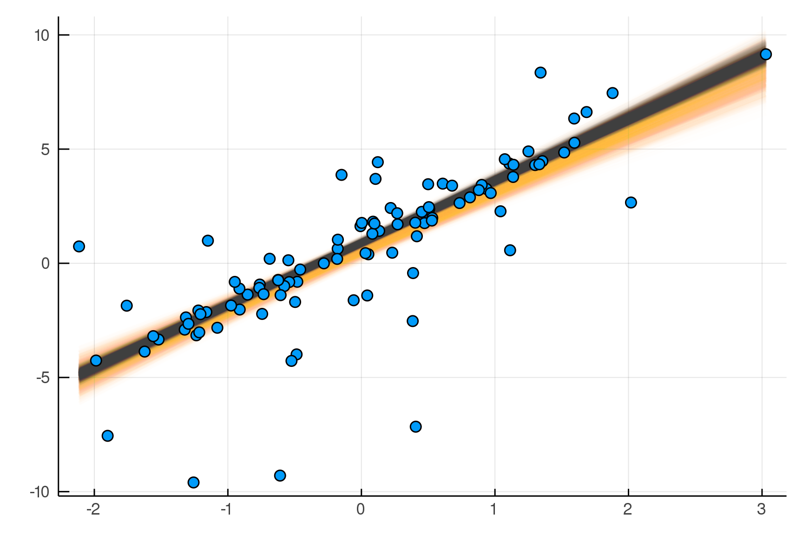
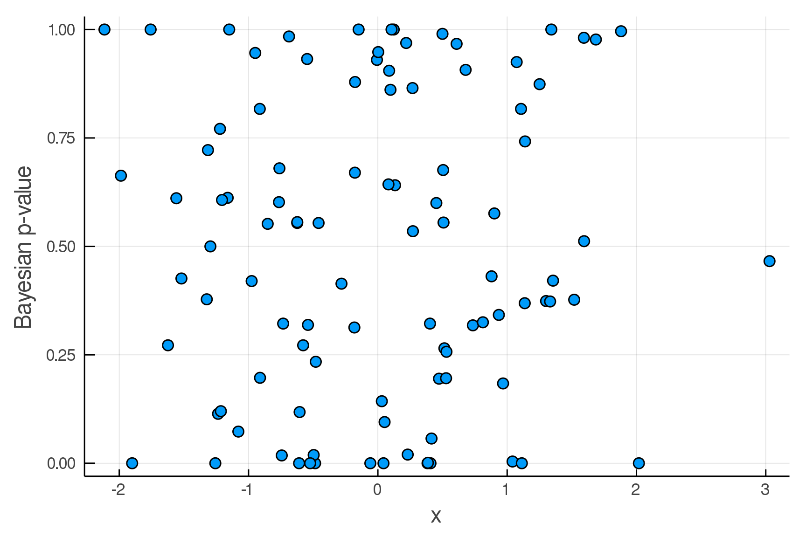
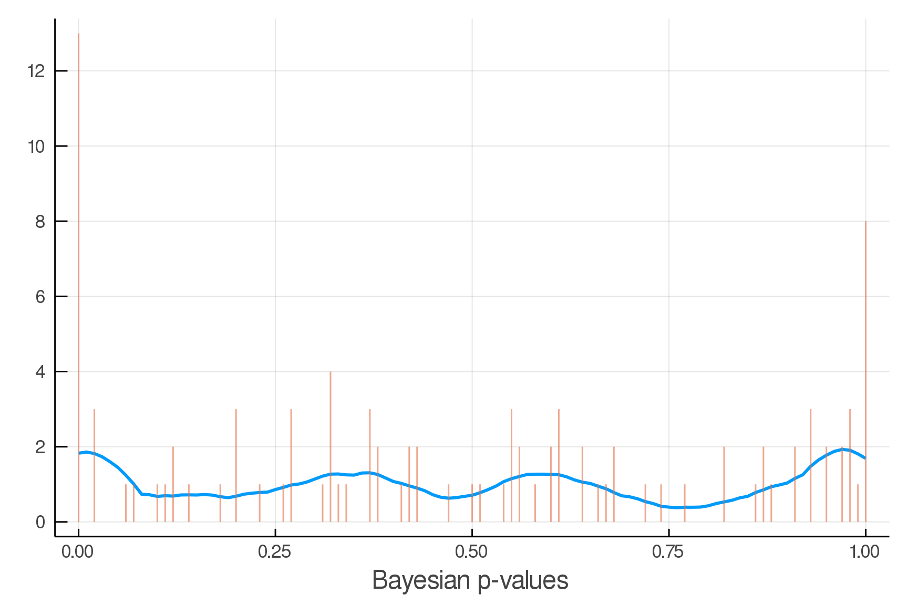

Build this file from Julia with

```
using Weave
weave("examples/2019-11-07-demo.jmd"
    , doctype= "github"      # to produce github-friendly markdown
    , cache=:refresh         # to force the cache to be refreshed
    , mod=Main               # to evaluate in the Main module
    , throw_errors=false     # to include any errors in the output (easier to troubleshoot)
    , args=Dict(:seed => 6)  # to set the random seed
    )
```


````julia
using Soss, Plots, NamedTupleTools
seed = WEAVE_ARGS[:seed]
import Random; Random.seed!(seed)
````


# Make some fake data

````julia
mt = @model x begin
    α = 1.0
    β = 3.0
    σ = 0.5
    yhat = α .+ β .* x
    n = length(x)
    y ~ For(n) do j
        Mix([Normal(yhat[j], σ), Normal(yhat[j],8σ)], [0.8,0.2])
    end
end;

x = randn(100); 
truth = rand(mt(x=x));
````


````julia
xx = range(extrema(truth.x)...,length=100)
scatter(truth.x,truth.y, legend=false, c=1)
# plot!(xx, truth.α .+ truth.β .* xx, dpi=300,legend=false, lw=3, c=2)
````


````julia
m = @model x begin
    α ~ Normal()
    β ~ Normal()
    σ ~ HalfNormal()
    yhat = α .+ β .* x
    n = length(x)
    y ~ For(n) do j
        Normal(yhat[j], σ)
    end
end;
````


````julia
m(x=truth.x)
````


````
Joint Distribution
    Bound arguments: [x]
    Variables: [σ, β, α, yhat, n, y]

@model x begin
        σ ~ HalfNormal()
        β ~ Normal()
        α ~ Normal()
        yhat = α .+ β .* x
        n = length(x)
        y ~ For(n) do j
                Normal(yhat[j], σ)
            end
    end
````


````julia
post = dynamicHMC(m(x=truth.x), (y=truth.y,)) 
ppost = particles(post)
````


````
(σ = 2.04 ± 0.15, β = 2.61 ± 0.2, α = 0.599 ± 0.21)
````


````julia
symlogpdf(m) |> foldConstants |> tolatex |> println
````


````
- 0.5 α^{2} - 0.5 β^{2} - 1.0 σ^{2} + \sum_{Idx\left(j_{1}\right)=1}^{n} \l
eft(- \frac{0.5 \left({y}_{Idx\left(j_{1}\right)} - 1.0 {\hat{y}}_{Idx\left
(j_{1}\right)}\right)^{2}}{σ^{2}} - 1.0 \log{\left(σ \right)} - 0.918938533
204673\right) - 3.67575413281869
````


````julia
symlogpdf(m) |> expandSums |> foldConstants |> tolatex |> println
````


````
- 1.0 \log{\left(σ \right)} n - 0.918938533204673 n - 0.5 α^{2} - 0.5 β^{2}
 - 1.0 σ^{2} - 3.67575413281869 - \frac{0.5 \sum_{Idx\left(j_{1}\right)=1}^
{n} \left({y}_{Idx\left(j_{1}\right)} - 1.0 {\hat{y}}_{Idx\left(j_{1}\right
)}\right)^{2}}{σ^{2}}
````


````julia
using BenchmarkTools
@btime logpdf($m(x=x),$truth)
````


````
26.210 μs (633 allocations: 12.47 KiB)
-901.7607073245318
````


````julia
@btime logpdf($(m(x=x)),$truth, codegen)
````


````
116.566 ns (1 allocation: 896 bytes)
-903.4977930382965
````


````julia
eachplot(xx, ppost.α .+ ppost.β .* xx, lw=3, dpi=300, color=:black)
scatter!(truth.x,truth.y, legend=false, c=1)
````


````julia
pred = predictive(m, :α, :β, :σ)
````


````
@model (x, α, β, σ) begin
        yhat = α .+ β .* x
        n = length(x)
        y ~ For(n) do j
                Normal(yhat[j], σ)
            end
    end
````


````julia
postpred = map(post) do θ 
    delete(rand(pred(θ)((x=x,))), :n, :x)
end |> particles
    

pvals = mean.(truth.y .> postpred.y)


# PPC vs x
scatter(truth.x, pvals, legend=false, dpi=300)
xlabel!("x")
ylabel!("Bayesian p-value")
````


````julia
# 
# 
# # PPC vs y
scatter(truth.y, pvals, legend=false, dpi=300)
xlabel!("y")
ylabel!("Bayesian p-value")
````


````julia
using AverageShiftedHistograms

o = ash(pvals, rng=0:0.01:1, kernel=Kernels.cosine,m=8)
plot(o, legend=false,dpi=300)
xlabel!("Bayesian p-values")
````


````julia
m2 = @model x begin
    α ~ Normal()
    β ~ Normal()
    σ ~ HalfNormal()
    yhat = α .+ β .* x
    νinv ~ HalfNormal()
    ν = 1/νinv
    n = length(x)
    y ~ For(n) do j
            StudentT(ν,yhat[j],σ)
        end
end;
````


````julia
post2 = dynamicHMC(m2(x=truth.x), (y=truth.y,))
ppost2 = particles(post2)
````


````
(σ = 0.519 ± 0.094, νinv = 0.905 ± 0.18, β = 2.73 ± 0.069, α = 0.892 ± 0.06
7)
````


````julia
eachplot(xx, ppost.α .+ ppost.β .* xx, lw=3, dpi=300, color=2)
eachplot!(xx, ppost2.α .+ ppost2.β .* xx, lw=3, dpi=300, color=:black)
scatter!(truth.x,truth.y, legend=false, c=1)
````




````julia
pred2 = predictive(m2, setdiff(stochastic(m2), [:y])...)
````


````
@model (x, α, β, σ, νinv) begin
        ν = 1 / νinv
        yhat = α .+ β .* x
        n = length(x)
        y ~ For(n) do j
                StudentT(ν, yhat[j], σ)
            end
    end
````


````julia
post2pred = map(post2) do θ 
    delete(rand(pred(θ)((x=x,))), :n, :x)
end |> particles
````


````
(α = 0.892 ± 0.067, β = 2.73 ± 0.069, σ = 0.519 ± 0.094, yhat = Particles{F
loat64,1000}[-2.7 ± 0.11, 1.26 ± 0.068, 4.59 ± 0.12, 1.01 ± 0.067, -2.48 ± 
0.11, 2.26 ± 0.076, 1.49 ± 0.069, -0.811 ± 0.08, -3.54 ± 0.13, 2.3 ± 0.076 
 …  5.25 ± 0.13, 0.975 ± 0.067, 0.9 ± 0.067, 4.53 ± 0.11, -0.985 ± 0.082, -
1.11 ± 0.084, 0.123 ± 0.07, 9.17 ± 0.22, 0.733 ± 0.067, -2.65 ± 0.11], y = 
Particles{Float64,1000}[-2.7 ± 0.54, 1.24 ± 0.53, 4.57 ± 0.54, 1.0 ± 0.54, 
-2.49 ± 0.55, 2.24 ± 0.52, 1.47 ± 0.52, -0.807 ± 0.55, -3.56 ± 0.55, 2.3 ± 
0.53  …  5.27 ± 0.53, 0.976 ± 0.53, 0.883 ± 0.52, 4.52 ± 0.55, -1.01 ± 0.54
, -1.12 ± 0.53, 0.0865 ± 0.54, 9.2 ± 0.55, 0.755 ± 0.53, -2.64 ± 0.55])
````


````julia
pvals2 = mean.(truth.y .> post2pred.y)
````


````
100-element Array{Float64,1}:
 0.738
 0.644
 0.42 
 0.0  
 0.119
 0.988
 0.961
 0.543
 0.266
 0.269
 ⋮    
 0.142
 0.96 
 0.357
 0.987
 0.306
 0.417
 0.466
 0.0  
 0.501
````


# PPC vs x
````julia
scatter(truth.x, pvals2, legend=false, dpi=300)
xlabel!("x")
ylabel!("Bayesian p-value")
````





# PPC vs y
````julia
scatter(truth.y, pvals2, legend=false, dpi=300)
xlabel!("y")
ylabel!("Bayesian p-value")
````


````julia
o = ash(pvals2, rng=0:0.01:1, kernel=Kernels.cosine,m=8)
plot(o, legend=false,dpi=300)
xlabel!("Bayesian p-values")
````





using Soss

m = @model begin
    μ ~ Normal() |> iid(2)
    σ ~ HalfNormal() |> iid(3)
    x ~ For(1:2,1:3) do i,j
        Normal(μ[i], σ[j])
    end
end;

truth = rand(m())

post = dynamicHMC(m(), (x=truth.x,)) |> particles

pred = predictive(m,:μ,:σ) 

predpost = pred(post) 

rand(predpost)
```